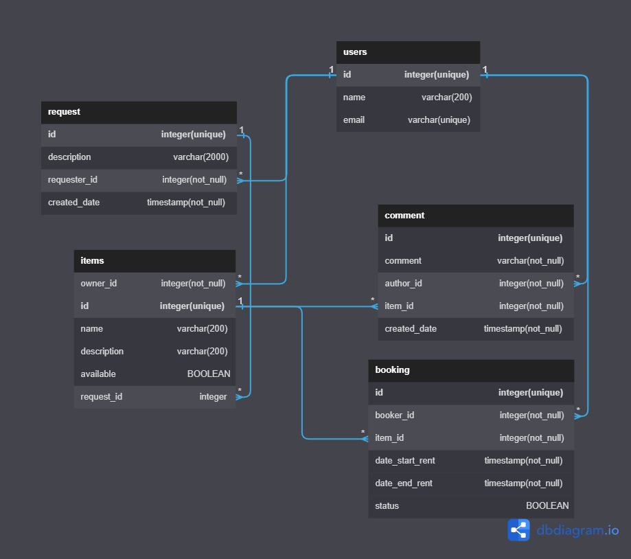

# java-shareit
Template repository for Shareit project.

## ПОСТАВЛЕННЫЕ ЦЕЛИ:

- Добавить "предмет" для аренды
- Выводить список доступных "предметов" для аренды
- Бронировать "предмет" по дата|время
- На время бронирования "предмет" не доступен к аренде
- Оставить запрос на аренду "предмета"
- Добавить отзыв после аренды "предмета"

## ТЕНХНОЛОГИИ:
- java 11
- Spring BOOT
- H2 SQL
- Maven
- PostgreSQL
- Docker

## Structure DB

#### Project FOR Yandex Practicum
